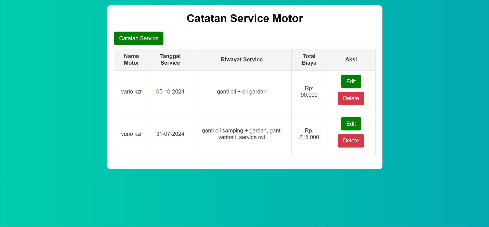

# Catatan Service Motor

Aplikasi Catatan Service Motor adalah sebuah aplikasi sederhana yang digunakan untuk mencatat dan mengelola riwayat service kendaraan bermotor, khususnya sepeda motor. Aplikasi ini membantu pengguna dalam mencatat berbagai informasi terkait service yang dilakukan pada motor mereka, seperti nama motor, tanggal service, dan deskripsi riwayat service. Dengan aplikasi ini, pengguna dapat dengan mudah memantau kapan service terakhir dilakukan dan apa saja perbaikan atau perawatan yang telah dilakukan.

# Fitur Utama

1. Input Data Service: Pengguna dapat menambahkan catatan service baru dengan mengisi informasi tentang nama motor, tanggal service, dan deskripsi riwayat service. Bisa juga menambahkan total biaya service.
1. Edit Data Service: Pengguna dapat memperbarui informasi catatan service yang sudah ada, misalnya jika ada kesalahan atau perubahan dalam rincian service.
1. Hapus Data Service: Pengguna dapat menghapus catatan service yang sudah tidak diperlukan.
1. Tampilan Daftar Service: Semua catatan service yang telah dimasukkan akan ditampilkan dalam bentuk daftar, sehingga pengguna dapat melihat riwayat service secara keseluruhan.